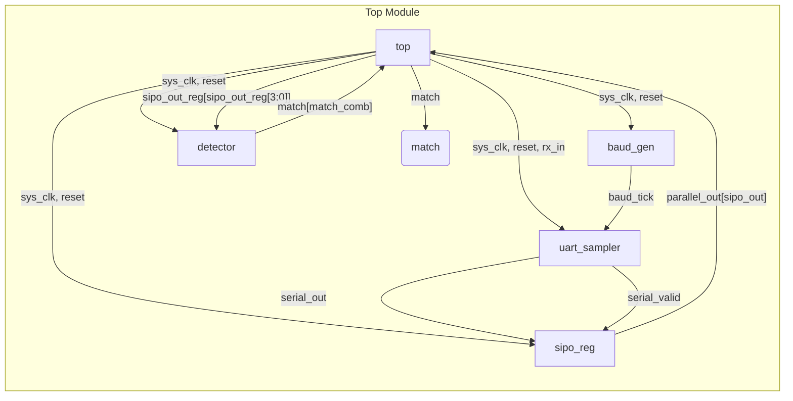
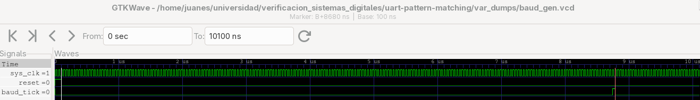
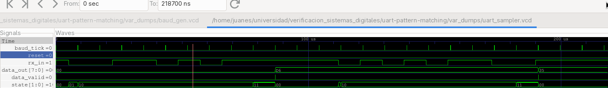
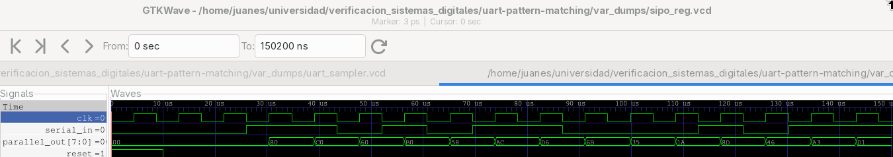
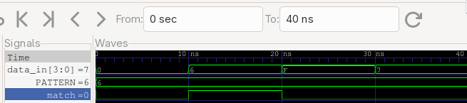
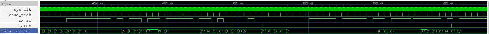

# UART Pattern Matching FSM

This project implements a pattern detector system that identifies a given 4-bit sequence in a serial input stream received via UART. The system is designed in Verilog and verified with a comprehensive testbench.

## System Overview

The system is composed of four main modules that work together to achieve the pattern detection:
1.  **Baud Rate Generator (`baud_gen.v`):** Generates the timing reference for the UART communication.
2.  **UART Sampler (`uart_sampler.v`):** Receives the serial data and outputs a bit-stream.
3.  **SIPO Register (`sipo_reg.v`):** Stores the most recent bits from the stream.
4.  **Pattern Detector (`detector.v`):** Compares the stored bits with the target pattern.

These modules are integrated in a top-level module (`top.v`) that provides the final output. The entire system is clocked by a 25 MHz system clock, while the UART communication operates at 115200 bps.

## Modules

### 1. Baud Rate Generator (`baud_gen.v`)

This module generates a sampling tick at the specified baud rate from a higher-frequency system clock.

**Functionality:**
- **Input:** 25 MHz system clock (`sys_clk`), active-high reset (`reset`).
- **Output:** A single-cycle pulse (`baud_tick`) at 115200 Hz.

The generator is implemented using a counter that divides the 25 MHz system clock by 217 to approximate the 115200 bps baud rate. The `baud_tick` is asserted for one `sys_clk` cycle when the counter reaches its limit.

#### Testbench and Verification

The testbench (`testbenches/baud_gen_tb.v`) is designed to verify the correct timing of the `baud_tick` signal.

**Test Strategy:**
1.  **Clock Generation:** A 25 MHz `sys_clk` is generated with a period of 40 ns.
2.  **Reset Sequence:** The simulation starts with the `reset` signal asserted for 100 ns to ensure the module initializes correctly. After 100 ns, the reset is de-asserted, and the counter begins.
3.  **Observation:** The simulation runs for 10 µs to allow for multiple ticks to be generated and observed.

**Simulation Results Analysis:**

**Expected vs. Actual Tick Time:**
- The system clock period is 40 ns.
- The counter limit is 217.
- The reset is held for 100 ns.

The first `baud_tick` is expected to occur after the reset period plus the time it takes for the counter to reach its limit:
- Expected Time = `Reset Time` + (`COUNTER_LIMIT` * `Clock Period`)
- Expected Time = 100 ns + (217 * 40 ns) = 100 ns + 8680 ns = **8780 ns**

The simulation output shows the first tick occurring at `8780000 ps` or `8780 ns`, which exactly matches the expected calculation. This confirms that the baud rate generator is functioning correctly.

For a more detailed analysis, the full waveform can be inspected in the VCD file located at `dumpvars/baud_gen.vcd`.

**Waveform:**

The following waveform shows the `baud_tick` being asserted periodically.

### 2. UART Sampler (`uart_sampler.v`)

This module is responsible for detecting a UART frame, sampling the 8 data bits, and outputting the received byte.

**Functionality:**
- **Inputs:** `sys_clk`, `reset`, `baud_tick` (from `baud_gen`), and the serial input `rx_in`.
- **Outputs:** `data_out` (the 8-bit received byte) and `data_valid` (a single-cycle pulse indicating new data is available).

The sampler uses a four-state finite state machine (FSM) to process the UART frame:
-   **IDLE:** Waits for a falling edge on `rx_in`, which signals the start bit.
-   **START_BIT:** Waits for the first `baud_tick` to synchronize the sampling process to the middle of the bit period.
-   **SAMPLING:** On the next 8 consecutive `baud_tick`s, it samples the `rx_in` line and shifts the data bits into an internal register.
-   **STOP_BIT:** Waits for one final `baud_tick` to cover the stop bit period, then asserts `data_valid` and makes the `data_out` available.

#### Testbench and Verification

The testbench (`testbenches/uart_sampler_tb.v`) verifies that the sampler can correctly receive a standard UART frame.

**Test Strategy:**
1.  **Frame Generation:** A task `send_uart_frame` is used to generate a UART frame with a start bit, 8 data bits (LSB first), and a stop bit.
2.  **Test Cases:** The testbench sends two bytes back-to-back: `8'hD6` (`11010110`) and `8'h35` (`00110101`).
3.  **Verification:** The `data_out` and `data_valid` signals are monitored to confirm that the bytes are received correctly.

**Simulation Results Analysis:**

- The first byte, `D6`, is correctly received, and `data_valid` is asserted at `t = 86.9 ns`.
- The second byte, `35`, is correctly received, and `data_valid` is asserted at `t = 191.06 ns`.

The simulation VCD is available at `var_dumps/uart_sampler.vcd`.

**Waveform:**

The waveform below shows the `rx_in` signal transmitting the byte `D6` and the corresponding `data_out` and `data_valid` signals after reception.

### 3. SIPO Register (`sipo_reg.v`)

This module implements an 8-bit Serial-In, Parallel-Out (SIPO) shift register. It is responsible for capturing the history of the last 8 bits received from the serial data stream, which is essential for pattern detection.

**Functionality:**
- **Inputs:** `clk` (driven by the `baud_tick`), `reset`, and `serial_in` (the data bit from the UART sampler).
- **Output:** `parallel_out` (an 8-bit vector representing the last 8 bits received).

On each clock cycle, the module shifts the `serial_in` bit into the most significant bit (MSB) of an 8-bit register. The existing bits are shifted to the right, and the oldest bit (at the LSB) is discarded. This creates a sliding window of the 8 most recent serial bits.

#### Testbench and Verification

The testbench (`testbenches/sipo_reg_tb.v`) is designed to confirm the correct shift-and-store operation of the register.

**Test Strategy:**
1.  **Initialization:** The simulation begins with a reset to ensure the register is cleared to zero.
2.  **Data Shifting:** The byte `8'hD6` (`11010110`) is shifted in bit-by-bit. This specific value is chosen because it is a non-trivial pattern of ones and zeros, which is effective for verifying that bits are not stuck or incorrectly shifted.
3.  **Window Sliding:** After the full byte is loaded, three additional bits (`1`, `0`, `1`) are shifted in. This test case is crucial to demonstrate that the register correctly handles a continuous data stream by discarding the oldest bits as new ones arrive, simulating the behavior required for overlapping pattern detection.

**Simulation Results Analysis:**

The simulation confirms the expected behavior. As each bit of `8'hD6` is clocked in, the `parallel_out` register is updated accordingly. After 8 clock cycles, `parallel_out` correctly holds the value `D6`. Subsequently, as the new bits `1`, `0`, and `1` are shifted in, the register value changes to `AD`, then `5A`, and finally `B5`, correctly reflecting the sliding window of the most recent 8 bits.

**Waveform:**

The waveform below illustrates the `serial_in` bit being shifted into the `parallel_out` register on each clock edge.

### 4. Pattern Detector (`detector.v`)

This is a simple combinational module that compares the four least significant bits of the SIPO register's output with a predefined pattern.

**Functionality:**
- **Input:** `data_in` (a 4-bit signal from the SIPO register).
- **Output:** `match` (asserted high when the input matches the pattern).

The pattern is hardcoded to `4'b0110`, which corresponds to the student ID digit `6`. The comparison is performed using a simple equality check.

#### Testbench and Verification

The testbench (`testbenches/detector_tb.v`) verifies the detector's logic by providing a series of inputs and checking the `match` output.

**Test Strategy:**
1.  **Matching Case:** The input is set to `4'b0110` to confirm that the `match` signal is correctly asserted.
2.  **Non-Matching Cases:** The input is set to various other patterns, such as `4'b1111` and `4'b0111`, to ensure the `match` signal remains low.

**Simulation Results Analysis:**

The simulation ran successfully, and the output confirms that the detector's logic is correct. The `match` signal was high only when the input was `0110`, and it was low for all other test cases. The testbench reported "All tests passed!", confirming the module's functionality.

**Waveform:**

The waveform below shows the `match` signal going high when the `data_in` matches the target pattern `0110`.

### 5. Top-Level Module (`top.v`)

This module integrates all the components into a single, functional system. It connects the baud rate generator, UART sampler, SIPO register, and pattern detector.

**Functionality:**
The `top` module is responsible for the correct data flow between the sub-modules. The most critical part of the design is ensuring that the data is sampled and checked for matches on the correct clock cycles. The final, debugged implementation uses the following logic:
- The `sipo_reg` is clocked by the main `sys_clk` and is enabled by the `serial_valid` signal from the `uart_sampler`.
- A one-cycle delay register (`sipo_out_reg`) is added to ensure the `detector` checks the SIPO register's state from the *previous* clock cycle, preventing a race condition.
- The final `match` signal is a single `sys_clk` pulse, generated combinationally from the `serial_valid` signal and the output of the detector.

#### Testbench and Verification

The testbench (`testbenches/top_tb.v`) is designed to verify the entire system's functionality with a comprehensive set of test cases:
1.  **Simple Match:** A byte is sent that contains the pattern at the end.
2.  **No Match:** A byte is sent that does not contain the pattern.
3.  **Overlapping Match:** A byte is sent that contains the pattern twice in an overlapping manner.
4.  **Back-to-Back Match:** Two consecutive bytes form the pattern at their boundary.
5.  **Noise/Glitch:** A short glitch is simulated on the `rx_in` line to ensure it is ignored.
6.  **Reset:** The reset signal is asserted during a transmission to ensure the system correctly returns to its idle state.

The testbench monitors the `match` output and prints a "SUCCESS" message when the pattern is detected, confirming that the system works as expected.

**Waveform:**

The waveform below shows the match of the sutendt ID **6** when the propper input is given:

